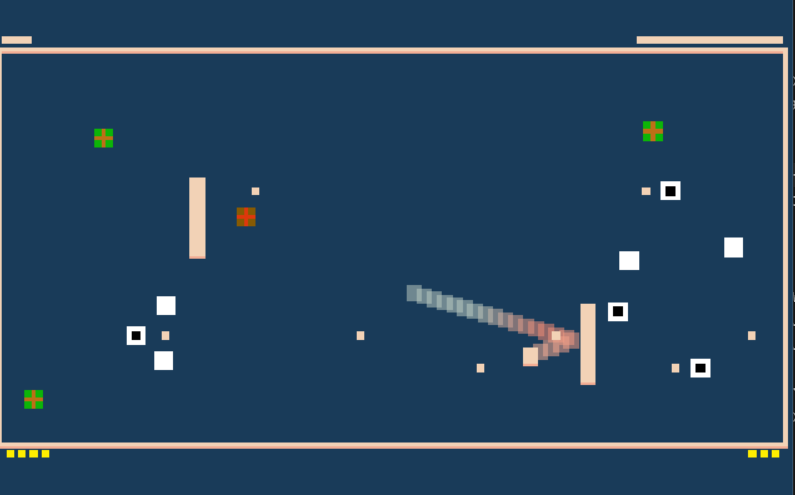

# (Pong of War)

Author: (Steven Lu)

Design: (Pong combined with real-time strategy. Build buildings to attack your enemy and defend your territory from both the ball and enemy attacks.)

Screen Shot:

How To Play:

Same mouse controls for pong. Additionally, use the key board to select buildings to purchase.
There are 3 types of buildings. Press the corresponding key and click on a valid area to purchase
a building. You can press the space bar to reset your selection.
|Key|Building|Price|Description                                                          |
|---|--------|-----|---------------------------------------------------------------------|
|Q  |Turret  |2    |Shoots bullets which destroy enemy buildings and damage their health |
|W  |Walls   |1    |Blocks bullets and can deflect the ball                              |
|E  |Farm    |5    |Generates additional income over time                                |

All buildings (including walls) will be destroyed if the ball hits them. Buildings other than walls
will be destroyed if a bullet from a turret (friendly or not) hits them. If bullets or the ball hit
the back of your court, you will lose hp (shown above the court). If your hp drops <= 0, you lose.
Your paddle can be used to block bullets and deflect the ball.

Buildings must be purchased using money which is displayed in the bottom. Money is earned passively over time
and from farm buildings. Buildings must be placed behind the paddle and inside the court, and cannot overlap.
The following table shows the prices of buildings:

Sources: 

This game was built with [NEST](NEST.md).
